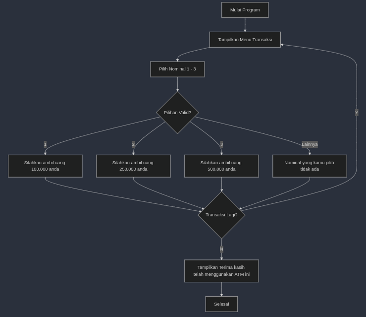

# Program ATM

## Deskripsi
Program ATM memungkinkan pengguna untuk memilih nominal uang yang akan diambil (100.000, 250.000, 500.000). Pengguna dapat melakukan transaksi berulang hingga memilih untuk berhenti.

## Alur Program
1. Menampilkan pilihan nominal uang (1-100.000, 2-250.000, 3-500.000).
2. Pengguna memilih nominal.
3. Jika pilihan valid, tampilkan pesan untuk mengambil uang yang sesuai.
4. Jika pilihan tidak valid, tampilkan pesan error.
5. Tanyakan apakah pengguna ingin melakukan transaksi lagi.
6. Program berhenti jika pengguna memilih `N`.

## Algoritma flow-chart


## **Petunjuk Kompilasi dan Eksekusi**
1. Simpan kode dalam file dengan nama, misalnya `print_star.cpp`.
2. Kompilasi program menggunakan perintah:
   ```bash
   g++ -o atm_program atm_program.cpp
   ```
3. Jalankan program:
   ```bash
   ./atm_program
   ```